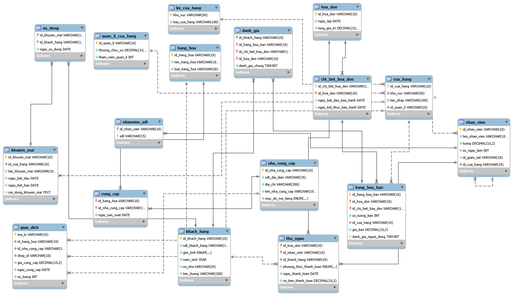

# qly_tttm

# 📦 Hệ Thống Quản Lý Trung Tâm Thương Mại

## 📌 Giới thiệu

Đây là project xây dựng hệ thống quản lý trung tâm thương mại, bao gồm:

* Quản lý cửa hàng
* Quản lý nhân viên
* Quản lý dữ liệu bằng MySQL
* Giao diện web cơ bản

---

## 🛠️ Công nghệ sử dụng

* Node.js
* MySQL
* HTML, CSS, JavaScript

---

## 📁 Cấu trúc thư mục

```
.
├── node_modules/
├── btl_sql.sql        # File CSDL (tạo bảng + dữ liệu)
├── server.js          # Backend Node.js
├── index.html         # Giao diện chính
├── package.json
├── package-lock.json
├── ảnh.png            # Hình minh họa
└── README.md
```

---

## ⚙️ Cài đặt và chạy project

### 1. Clone project

```
git clone https://github.com/your-username/your-repo.git
```

### 2. Cài đặt thư viện

```
npm install
```

### 3. Import cơ sở dữ liệu

* Mở MySQL
* Import file:

```
btl_sql.sql
```

---

### 4. Chạy server

```
node server.js
```

---

### 5. Mở giao diện

Mở file:

```
index.html
```

hoặc truy cập:

```
http://localhost:3000
```

---

## 🚀 Chức năng chính

* Thực hiện CRUD dữ liệu
* Kết nối database MySQL
* Hiển thị dữ liệu trên giao diện web

---

## 📷 Hình minh họa



---

## 📌 Ghi chú

* Đảm bảo MySQL đang chạy trước khi start server
* Cấu hình database trong `server.js` nếu cần

---


